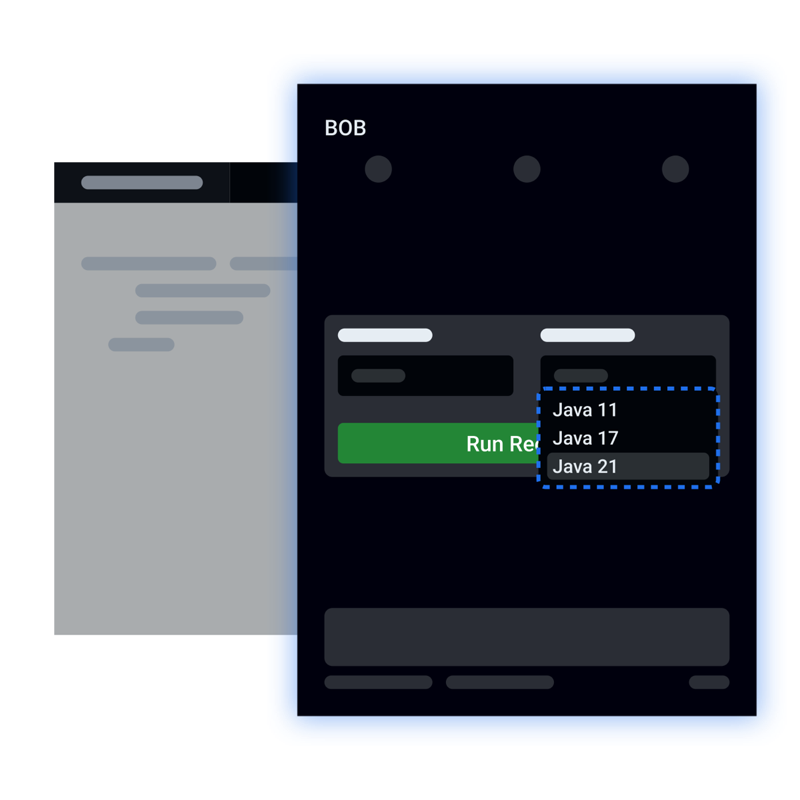
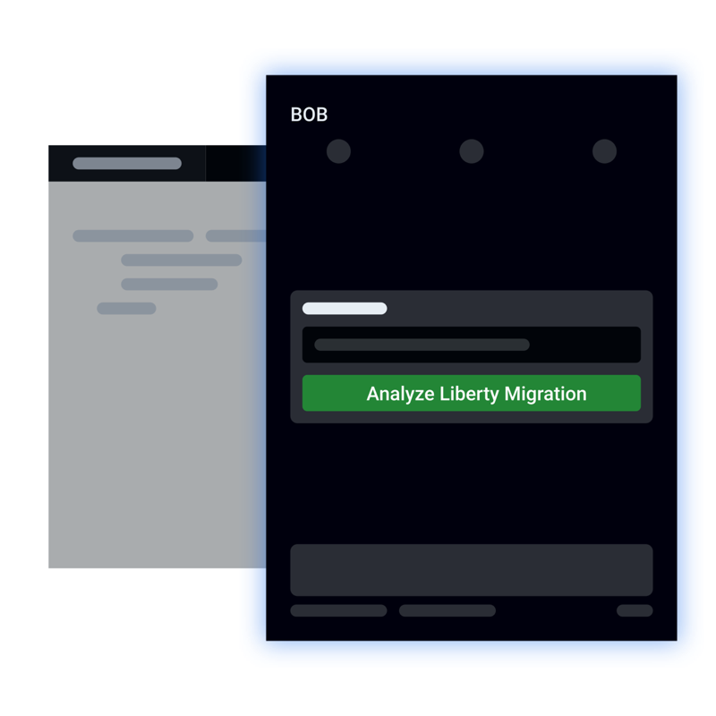
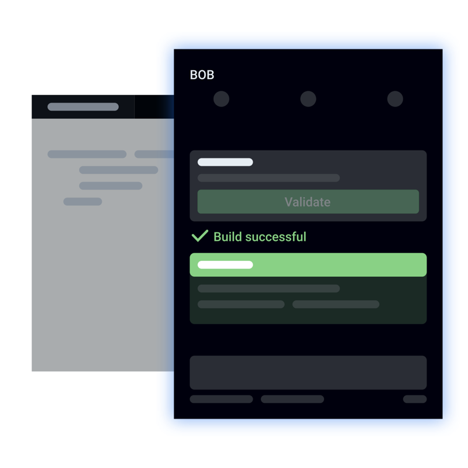
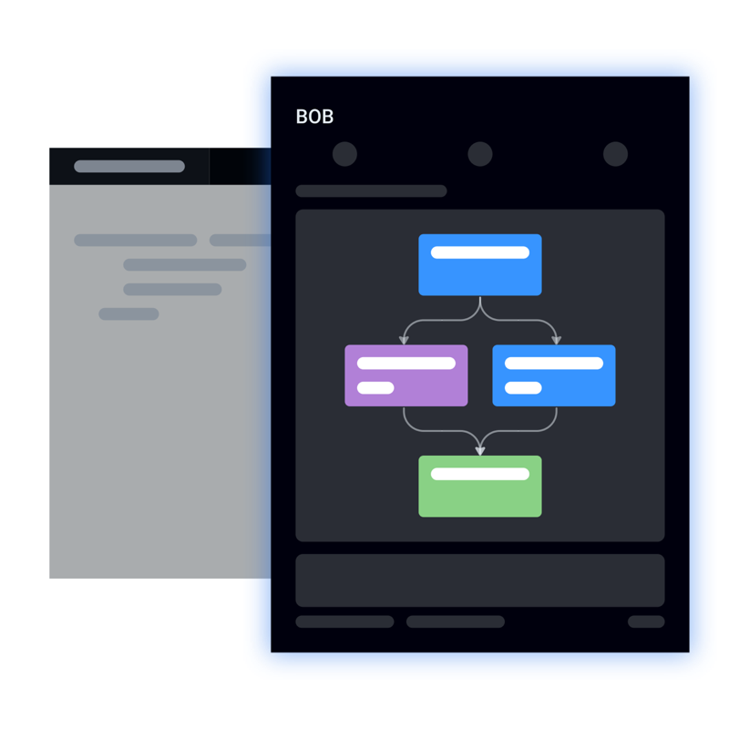

# Bob Java Premium Add-On

Bob Java Premium Add-On extends [IBM Bob](https://bob.ibm.com) with guided Java modernization capabilities for enterprise applications.

Modernize Java estates with Bob workflows and tools designed for four core scenarios:

- **Java Upgrade**
- **Java Unit Test Generation**
- **WebSphere to Liberty Migration**
- **UI Modernization**

## Why Bob Java Premium Add-On

Teams modernizing Java applications usually need more than code generation. They need guided workflows, repeatable migration steps, and tooling that understands enterprise modernization goals.

Bob Java Premium Add-On adds Java-focused modernization support directly into Bob so teams can move faster on high-value work inside the editor.

## Key Capabilities

| Capability                         | Description                                                                                                                               |
| ---------------------------------- | ----------------------------------------------------------------------------------------------------------------------------------------- |
| **Java Upgrade**                   | Use Bob workflows tailored for Java upgrade scenarios to help structure runtime and application modernization work.                       |
| **Java Unit Test Generation**      | Generate Java unit tests to expand test coverage and support safer refactoring during modernization and maintenance work.                 |
| **WebSphere to Liberty Migration** | Accelerate migration work for applications moving from traditional WebSphere environments to Liberty with Java-focused tools and recipes. |
| **UI Modernization**               | Use Bob to assist with modernization work that spans Java backends and frontend-facing application layers.                                |
| **Java-aware Bob integration**     | Surface Java-specific tools, recipes, test generation, and environment-aware capabilities directly in the Bob experience.                 |

## Common Scenarios

### Upgrade legacy Java applications

Move applications toward newer Java versions with workflow guidance that helps structure modernization tasks.

### Re-platform middleware workloads

Support application migration from WebSphere traditional environments toward Liberty-based deployments.

### Generate Java unit tests

Create Java unit tests for existing code to support safer refactoring and modernization.

### Modernize existing application experiences

Use Bob to help plan and implement UI refresh work connected to Java applications.

## Getting Started

1. Install [IBM Bob](https://bob.ibm.com).
2. Install Bob Java Premium Add-On.
3. Open your Java project or workspace in VS Code.
4. Start Bob and select the Java modernization capabilities made available by this add-on.

## Requirements

- Visual Studio Code `^1.106.1`
- [IBM Bob](https://bob.ibm.com)

## What This Extension Adds

This extension contributes Java modernization capabilities on top of Bob, including:

- Java modernization mode
- Java unit test generation capabilities
- Java-specific tools for recipes, environment detection, and testing support
- Workflows for upgrade and migration scenarios

## Screenshots

### Java Upgrade workflow

[][java-upgrade-step] [][java-upgrade-validate] [][java-upgrade-plan]

[java-upgrade-step]: assets/java-upgrade/04-java-upgrade-version.png
[java-upgrade-validate]: assets/java-upgrade/07-validate.png
[java-upgrade-plan]: assets/java-upgrade/06-mermaid.png

### WebSphere to Liberty migration workflow

[][liberty-selection] [][liberty-validate] [][liberty-plan]

[liberty-selection]: assets/liberty-replatforming/03-liberty-select.png
[liberty-validate]: assets/liberty-replatforming/06-validate.png
[liberty-plan]: assets/liberty-replatforming/05-mermaid.png

## FAQ

### Does this extension work by itself?

No. This add-on extends [IBM Bob](https://bob.ibm.com) and depends on it.

### Who is this extension for?

It is intended for teams modernizing enterprise Java applications and related platforms.

### Does this only cover code upgrades?

No. The extension is positioned for broader modernization work, including runtime upgrades, Java unit test generation, platform migration, and UI modernization support.

## Feedback and Support

- Issues: https://github.com/ibm/bob/issues
- Source: https://github.com/ibm/bob/tree/main/bob-java

## License

See [`LICENSE`](LICENSE).
